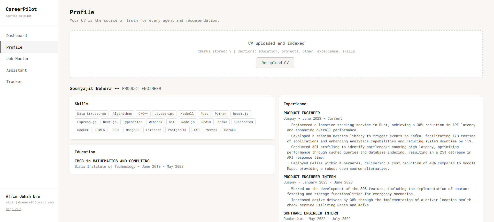
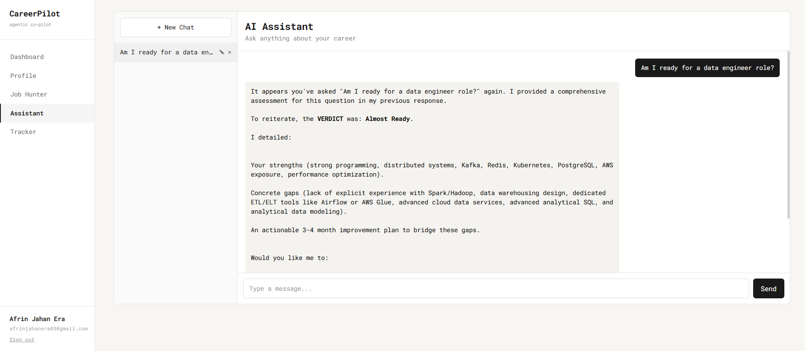
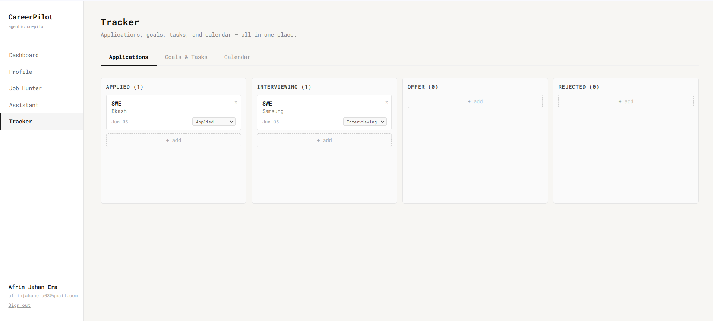

# CareerPilot


### Your Agentic Career Co-pilot


*An AI-powered platform that knows you — hunts jobs, scores your fit, drafts your applications, and builds your learning roadmap.*


Built for **Codesprint 2026** · Powered by [Poridhi.io](https://poridhi.io)

[View Problem Statement](https://github.com/ridika-2004/CareerPilot/blob/main/Problem%20Statement.pdf)


## Overview


CareerPilot is an end-to-end agentic career platform built with **React** (frontend), **Django** (backend) and **MongoDB** (Database). It eliminates the fragmented job-search experience by combining a RAG-powered CV engine, an intelligent job hunter agent, a personal AI assistant, and a productivity tracker — all in one platform.


Every AI response is grounded in **your actual CV**, not hallucinated generic profiles.


## Features


### Pillar 1 — Job Hunter Agent


> 

- Natural language job search: *"Find me ML internships in Dhaka open this month"*
- Returns structured job cards: role, company, salary range, deadline, location, fit score
- Agent explains why each result matches your profile, grounded in your CV


### Pillar 2 — Profile & Resume Intelligence (RAG Core)

> 

- Upload a PDF/DOCX CV or build one directly in the platform
- CV is chunked by section: experience, education, skills, projects
- Chunks are embedded and stored in a vector database
- All downstream features — job matching, cover letters, gap analysis — query this store


### Pillar 3 — Personal AI Assistant

> 

- Conversational interface with full context of your profile
- Handles queries such as:
  - *"Am I ready for this data engineer role?"*
  - *"What skills am I missing for a Google internship?"*
  - *"Build me a 3-month roadmap to become job-ready"*
  - *"Draft a cover letter for this job posting"*


### Pillar 4 — Productivity & Progress Tracker

> 

- **Calendar & To-Do**: Deadline reminders linked to career goals
- **Goal Setting**: Weekly/daily targets for applications, courses, and CV updates
- **Application Tracker**: Kanban board — Applied, Interviewing, Offer, Rejected
- **Progress Dashboard**: Applications sent, skills added, roadmap completion, streak counter
- **AI Nudges**: Proactive reminders based on your activity


## Tech Stack

| Layer | Technology |
|---|---|
| Frontend | React 18, Tailwind CSS |
| Backend | Django 5, Django REST Framework |
| Database | MongoDB |
| AI / LLM | Google AI |


## Project Structure


```
careerpilot/
├── backend/
│   ├── careerpilot/          # Project settings
│   ├── accounts/             # User auth & profiles
│   ├── resume/               # CV upload, parsing, RAG pipeline
│   ├── jobs/                 # Job hunter agent
│   ├── assistant/            # AI chat assistant
│   ├── tracker/              # Kanban, goals, calendar
│   └── requirements.txt
│
├── frontend/
│   ├── src/
│   │   ├── components/       # Reusable UI components
│   │   ├── pages/            # Route-level pages
│   │   ├── hooks/            # Custom React hooks
│   │   ├── api/              # API service layer
│   │   └── store/            # State management
│   └── package.json
│
└── README.md
```

## Local Setup


### Prerequisites


- Python 3.11+
- React.js 18+
- MongoDB (or cluster DB)
- API key for your chosen LLM provider


### 1. Clone the repository


```bash
git clone https://github.com/AfrinJahanEra/CareerPilot.git
cd careerpilot
```


### 2. Backend setup


```bash
cd backend
python -m venv venv
source venv/bin/activate        # Windows: venv\Scripts\activate
pip install -r requirements.txt
```


Create a `.env` file inside `backend/`:


```env
SECRET_KEY=your_django_secret_key
DEBUG=True
DATABASE_URL=your_mongo_atlas_url
ADMIN_SECRET_KEY=ad123
GOOGLE_API_KEY=your_openai_api_key
```


Run migrations and start the server:


```bash
python manage.py migrate
python manage.py runserver
```


Backend runs at `http://localhost:8000`


### 3. Frontend setup


```bash
cd ../frontend
npm install
```


Create a `.env` file inside `frontend/`:


```env
VITE_API_BASE_URL=http://localhost:8000/api
```


Start the development server:


```bash
npm run dev
```


Frontend runs at `http://localhost:5173`


## Running Tests


```bash
# Backend
cd backend
python manage.py test


# Frontend
cd frontend
npm run test
```


## Demo

[Watch the demo video](https://youtu.be/_1qxkC4VCvQ?si=u27XqwLVNoGgLB2t)


The demo covers this full flow: CV upload → job search → fit score → AI assistant query → cover letter draft → tracker update.


## License


This project is licensed under the [MIT License](LICENSE).
